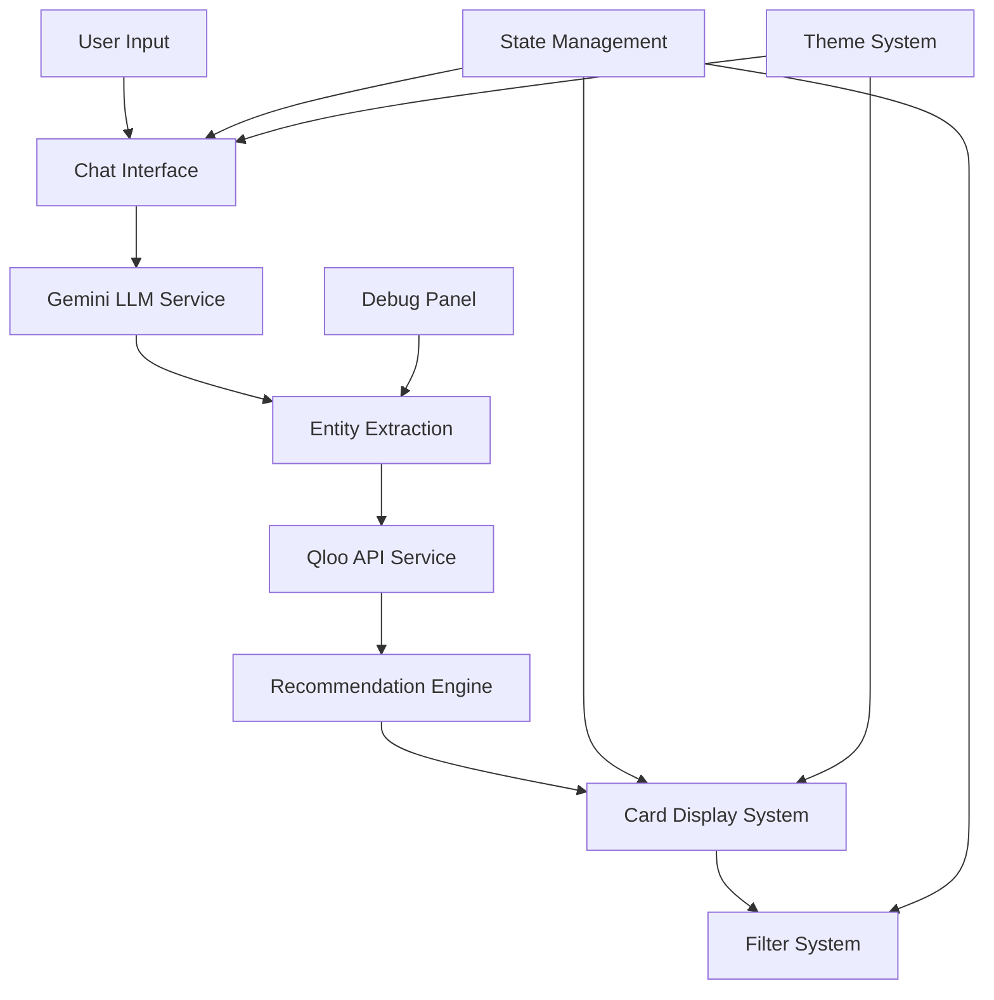

# Design Document

## Overview

TasteSphere is a modern, responsive React application that transforms natural language input into personalized recommendations across multiple content domains. The system architecture follows a client-side approach with React hooks for state management, integrating with external APIs (Gemini LLM and Qloo) to provide intelligent recommendation services. The design emphasizes user experience through a conversational interface, smooth animations, and comprehensive error handling.

## Architecture

### High-Level Architecture



### Component Architecture

The application follows a modular component structure with clear separation of concerns:

- **Layout Components**: Handle overall app structure and responsive design
- **Chat Components**: Manage conversational interface and message flow
- **Recommendation Components**: Display and manage recommendation cards
- **Service Components**: Handle API integrations and data processing
- **Utility Components**: Provide reusable UI elements and helpers

### State Management Strategy

The application uses React hooks for state management with the following approach:
- **useContext** for global state (theme, debug mode, API keys)
- **useState** for component-level state (messages, filters, loading states)
- **useReducer** for complex state transitions (chat flow, recommendation processing)
- **Custom hooks** for API interactions and business logic

## Components and Interfaces

### Core Components

#### 1. App Component (`src/App.jsx`)
- **Purpose**: Root component managing global state and layout
- **Props**: None
- **State**: Theme, debug mode, API configuration
- **Responsibilities**: 
  - Initialize global context providers
  - Handle theme switching
  - Manage responsive layout structure

#### 2. ChatInterface Component (`src/components/ChatInterface.jsx`)
- **Purpose**: Main chat container with message display and input
- **Props**: None (uses context)
- **State**: Messages array, current input, loading states
- **Responsibilities**:
  - Render message history
  - Handle user input submission
  - Manage chat scroll behavior
  - Display typing indicators

#### 3. MessageBubble Component (`src/components/MessageBubble.jsx`)
- **Purpose**: Individual message display with user/AI styling
- **Props**: `{ message, type, timestamp, isLoading }`
- **State**: Animation state
- **Responsibilities**:
  - Render message content with appropriate styling
  - Handle message animations
  - Display timestamps and status indicators

#### 4. RecommendationGrid Component (`src/components/RecommendationGrid.jsx`)
- **Purpose**: Grid layout for recommendation cards with filtering
- **Props**: `{ recommendations, activeFilters, onFilterChange }`
- **State**: Grid layout state, animation states
- **Responsibilities**:
  - Render recommendation cards in responsive grid
  - Handle filter interactions
  - Manage grid animations and transitions

#### 5. RecommendationCard Component (`src/components/RecommendationCard.jsx`)
- **Purpose**: Individual recommendation display card
- **Props**: `{ recommendation, entityType, metadata }`
- **State**: Hover state, image loading state
- **Responsibilities**:
  - Display recommendation details
  - Handle placeholder images
  - Provide interactive hover effects

#### 6. FilterChips Component (`src/components/FilterChips.jsx`)
- **Purpose**: Entity type filter controls
- **Props**: `{ availableTypes, activeFilters, onFilterToggle }`
- **State**: Filter animation states
- **Responsibilities**:
  - Render filter chips for each entity type
  - Handle filter toggle interactions
  - Provide visual feedback for active filters

#### 7. DebugPanel Component (`src/components/DebugPanel.jsx`)
- **Purpose**: Developer debugging interface for entity analysis
- **Props**: `{ isOpen, analysisData, onToggle }`
- **State**: Panel animation state
- **Responsibilities**:
  - Display parsed Gemini analysis
  - Show entity extraction results
  - Provide expandable/collapsible interface

#### 8. InputBox Component (`src/components/InputBox.jsx`)
- **Purpose**: User input interface with submission controls
- **Props**: `{ onSubmit, isLoading, placeholder }`
- **State**: Input value, validation state
- **Responsibilities**:
  - Handle user text input
  - Validate input before submission
  - Provide submission feedback

### Service Interfaces

#### 1. GeminiService (`src/services/geminiService.js`)
```javascript
interface GeminiService {
  extractEntities(input: string): Promise<EntityAnalysis>
  generateResponse(entities: Entity[]): Promise<string>
}

interface EntityAnalysis {
  entities: Entity[]
  confidence: number
  processingTime: number
}

interface Entity {
  name: string
  type: EntityType
  confidence: number
  context: string
}
```

#### 2. QlooService (`src/services/qlooService.js`)
```javascript
interface QlooService {
  getRecommendations(entities: Entity[]): Promise<Recommendation[]>
  buildInsightsUrl(entityType: string, signalEntities: string[]): string
}

interface QlooApiConfig {
  baseUrl: 'https://hackathon.api.qloo.com'
  apiKey: 'qzuLeMriOgE8HuaHslZkpSs5fTu-VU4-iukY6dD6J8k'
  headers: { 'X-Api-Key': string }
}

interface Recommendation {
  id: string
  name: string
  type: EntityType
  metadata: RecommendationMetadata
  imageUrl?: string
  score: number
}
```

### Utility Interfaces

#### 1. ThemeProvider (`src/contexts/ThemeContext.jsx`)
- Manages light/dark mode state
- Provides theme toggle functionality
- Handles system preference detection

#### 2. ApiProvider (`src/contexts/ApiContext.jsx`)
- Manages API keys and configuration
- Provides error handling utilities
- Handles rate limiting and retry logic

## Data Models

### Message Model
```javascript
interface Message {
  id: string
  content: string
  type: 'user' | 'ai'
  timestamp: Date
  status: 'sending' | 'sent' | 'error'
  recommendations?: Recommendation[]
}
```

### Entity Types (Qloo API Supported)
```javascript
enum EntityType {
  PLACE = 'place',
  MOVIE = 'movie', 
  BRAND = 'brand',
  PERSON = 'person',
  TV_SHOW = 'tv_show',
  PODCAST = 'podcast',
  BOOK = 'book',
  DESTINATION = 'destination',
  ARTIST = 'artist'
}

// Qloo API URN mapping
const QLOO_ENTITY_URNS = {
  PLACE: 'urn:entity:place',
  MOVIE: 'urn:entity:movie',
  BRAND: 'urn:entity:brand', 
  PERSON: 'urn:entity:person',
  TV_SHOW: 'urn:entity:tv_show',
  PODCAST: 'urn:entity:podcast',
  BOOK: 'urn:entity:book',
  DESTINATION: 'urn:entity:destination',
  ARTIST: 'urn:entity:artist'
}
```

### Filter State
```javascript
interface FilterState {
  [EntityType]: boolean
}
```

### Application State
```javascript
interface AppState {
  messages: Message[]
  currentInput: string
  isLoading: boolean
  activeFilters: FilterState
  debugMode: boolean
  theme: 'light' | 'dark'
  lastAnalysis: EntityAnalysis | null
}
```

## Error Handling

### API Error Handling Strategy

1. **Gemini API Errors**:
   - Network failures: Show retry button with exponential backoff
   - Rate limiting: Display wait time and auto-retry
   - Invalid responses: Fall back to basic keyword extraction
   - Authentication errors: Prompt for API key configuration

2. **Qloo API Errors**:
   - Network failures: Show error message with manual retry option
   - Rate limiting: Implement request queuing with user feedback
   - Invalid entity types: Filter out unsupported entities
   - Empty results: Display "no recommendations found" message

3. **Client-Side Errors**:
   - Invalid input: Show validation messages inline
   - State corruption: Implement error boundaries with recovery
   - Memory issues: Implement message history limits
   - Storage failures: Graceful degradation without persistence

### Error Recovery Mechanisms

- **Automatic Retry**: For transient network errors with exponential backoff
- **Manual Retry**: User-initiated retry buttons for failed operations
- **Graceful Degradation**: Core functionality remains available during partial failures
- **Error Boundaries**: Prevent component crashes from affecting entire application

## Testing Strategy

### Unit Testing Approach

1. **Component Testing**:
   - Test component rendering with various props
   - Verify user interaction handling
   - Test responsive behavior across screen sizes
   - Validate accessibility compliance

2. **Service Testing**:
   - Mock API responses for consistent testing
   - Test error handling scenarios
   - Verify data transformation logic
   - Test retry mechanisms and rate limiting

3. **Integration Testing**:
   - Test complete user flows from input to recommendations
   - Verify API integration with mock services
   - Test state management across component boundaries
   - Validate theme switching and persistence

### Testing Tools and Framework

- **Jest**: Unit testing framework
- **React Testing Library**: Component testing utilities
- **MSW (Mock Service Worker)**: API mocking for integration tests
- **Cypress**: End-to-end testing for critical user flows

### Test Coverage Goals

- **Components**: 90% coverage for all UI components
- **Services**: 95% coverage for API integration logic
- **Utilities**: 100% coverage for helper functions
- **Integration**: Cover all primary user journeys

## Performance Considerations

### Optimization Strategies

1. **React Optimization**:
   - Use React.memo for expensive components
   - Implement useMemo for complex calculations
   - Use useCallback for event handlers
   - Lazy load components with React.lazy

2. **API Optimization**:
   - Implement request debouncing for user input
   - Cache API responses with appropriate TTL
   - Use request deduplication for identical queries
   - Implement progressive loading for large result sets

3. **Rendering Optimization**:
   - Virtual scrolling for large message histories
   - Image lazy loading with intersection observer
   - CSS-in-JS optimization with styled-components
   - Bundle splitting for code optimization

### Performance Monitoring

- **Core Web Vitals**: Monitor LCP, FID, and CLS metrics
- **API Response Times**: Track and alert on slow API responses
- **Memory Usage**: Monitor for memory leaks in long sessions
- **Bundle Size**: Track and optimize JavaScript bundle sizes

## Security Considerations

### API Security

1. **API Key Management**:
   - Store API keys in environment variables
   - Implement key rotation capabilities
   - Use secure key storage in production
   - Validate API key format and permissions

2. **Request Security**:
   - Implement request rate limiting
   - Validate all user inputs before API calls
   - Use HTTPS for all external API communications
   - Implement request signing where required

### Client-Side Security

1. **Input Validation**:
   - Sanitize all user inputs
   - Implement XSS protection
   - Validate data types and formats
   - Limit input length and complexity

2. **Data Protection**:
   - Avoid storing sensitive data in localStorage
   - Implement secure session management
   - Use Content Security Policy headers
   - Validate all external data sources

## Deployment and Infrastructure

### Build Configuration

- **Vite Configuration**: Optimized for production builds
- **Environment Variables**: Separate configs for dev/staging/prod
- **Asset Optimization**: Image compression and lazy loading
- **Bundle Analysis**: Regular bundle size monitoring

### Deployment Strategy

- **Static Hosting**: Deploy to CDN for optimal performance
- **Environment Management**: Separate deployments for different stages
- **CI/CD Pipeline**: Automated testing and deployment
- **Monitoring**: Real-time error tracking and performance monitoring