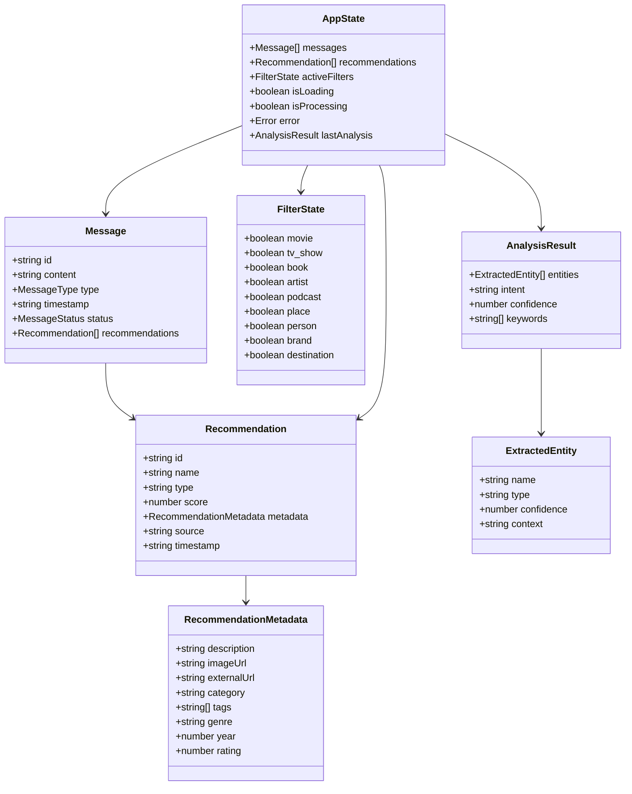

# TasteSphere - AI-Powered Recommendation System

TasteSphere is a modern, AI-powered recommendation system that provides personalized suggestions for movies, TV shows, books, music, podcasts, places, people, brands, and destinations. Built with React, it features a chat-based interface powered by Google's Gemini AI and Qloo's recommendation API.

## 🔄 System Architecture & Workflow

### Detailed System Flow Diagram


### Detailed Component Interaction Flow


### Data Flow Architecture


### Error Handling Flow


## 🌟 Features

### Core Functionality
- **AI-Powered Chat Interface**: Natural language interaction using Google Gemini AI
- **Multi-Category Recommendations**: Movies, TV shows, books, music, podcasts, places, people, brands, and destinations
- **Real-Time Filtering**: Interactive filter chips to refine recommendations by category
- **Responsive Design**: Optimized for desktop, tablet, and mobile devices
- **Dark Mode Support**: Toggle between light and dark themes

### User Experience
- **Colorful Placeholder Images**: Type-specific placeholder images with distinct colors
- **Smooth Animations**: Framer Motion animations for enhanced user experience
- **Loading States**: Skeleton components and loading indicators
- **Error Handling**: Comprehensive error boundaries and user-friendly error messages
- **Accessibility**: Full WCAG compliance with screen reader support

### Technical Features
- **API Integration**: Seamless integration with Qloo recommendation API
- **State Management**: Context-based state management with React hooks
- **Performance Optimization**: Memoization, lazy loading, and efficient re-renders
- **Testing Suite**: Comprehensive test coverage with Vitest and React Testing Library
- **TypeScript Support**: Full TypeScript integration for type safety

## 🚀 Getting Started

### Prerequisites
- Node.js (v18 or higher)
- npm or yarn package manager

### Installation

1. **Clone the repository**
   ```bash
   git clone https://github.com/Darkcoder011/TasteSpheree.git
   cd TasteSpheree
   ```

2. **Install dependencies**
   ```bash
   npm install
   ```

3. **Set up environment variables**
   Create a `.env` file in the root directory:
   ```env
   VITE_GEMINI_API_KEY=your_gemini_api_key_here
   VITE_QLOO_API_KEY=your_qloo_api_key_here
   ```

4. **Start the development server**
   ```bash
   npm run dev
   ```

5. **Open your browser**
   Navigate to `http://localhost:5173`

## 🛠️ API Configuration

### Google Gemini AI
- Sign up at [Google AI Studio](https://makersuite.google.com/)
- Generate an API key
- Add it to your `.env` file as `VITE_GEMINI_API_KEY`

### Qloo Recommendation API
- Contact Qloo for API access
- Add your API key to `.env` file as `VITE_QLOO_API_KEY`

## 📱 Usage

1. **Start a Conversation**: Type your interests in the chat input
   - Example: "I love sci-fi movies and indie music"

2. **View Recommendations**: The system will analyze your input and provide personalized recommendations

3. **Filter Results**: Use the filter chips to show/hide specific categories

4. **Explore Details**: Each recommendation card shows:
   - Name and type
   - Confidence score
   - Description (when available)
   - Genre and additional metadata

## 🏗️ Detailed Project Architecture

### Component Hierarchy


### Service Architecture


### Data Models & Types



### API Integration Flow


### Project Structure (Detailed)

```
src/
├── components/                 # React Components
│   ├── ui/                    # Reusable UI Components
│   │   ├── ThemeToggle.jsx    # Dark/Light mode toggle
│   │   ├── LoadingSpinner.jsx # Loading indicators
│   │   ├── FocusRing.jsx      # Accessibility focus ring
│   │   └── index.js           # UI components barrel export
│   ├── skeletons/             # Loading Skeleton Components
│   │   ├── AppSkeleton.jsx    # Main app skeleton
│   │   ├── MessageSkeleton.jsx # Chat message skeleton
│   │   ├── RecommendationCardSkeleton.jsx
│   │   ├── FilterChipsSkeleton.jsx
│   │   └── index.js           # Skeletons barrel export
│   ├── ChatInterface.jsx      # Main chat interface
│   ├── MessageBubble.jsx      # Individual chat messages
│   ├── InputBox.jsx           # Message input component
│   ├── FilterChips.jsx        # Recommendation filters
│   ├── FilteredRecommendationView.jsx # Filter + Grid wrapper
│   ├── RecommendationGrid.jsx # Grid layout for recommendations
│   ├── RecommendationCard.jsx # Individual recommendation cards
│   ├── ControlButtons.jsx     # Chat control buttons
│   ├── ScreenReader.jsx       # Screen reader announcements
│   ├── SkipLinks.jsx          # Accessibility skip links
│   ├── NetworkStatus.jsx      # Network connectivity status
│   ├── OfflineMode.jsx        # Offline mode indicator
│   ├── DebugPanel.jsx         # Development debug panel
│   ├── ErrorBoundary.jsx      # Generic error boundary
│   ├── ChatErrorBoundary.jsx  # Chat-specific error boundary
│   ├── RecommendationErrorBoundary.jsx # Recommendation error boundary
│   ├── ApiErrorBoundary.jsx   # API error boundary
│   └── __tests__/             # Component test files
├── contexts/                  # React Context Providers
│   ├── AppStateContext.jsx    # Global application state
│   ├── ThemeContext.jsx       # Theme management
│   ├── ApiContext.jsx         # API configuration
│   └── index.js               # Context barrel export
├── hooks/                     # Custom React Hooks
│   ├── useAccessibility.js    # Accessibility utilities
│   ├── useDebugData.js        # Debug information hook
│   ├── useErrorHandler.js     # Error handling hook
│   ├── useLazyImage.js        # Lazy image loading
│   ├── useNetworkStatus.js    # Network connectivity
│   ├── useRecommendations.js  # Recommendation management
│   └── __tests__/             # Hook test files
├── services/                  # API Services & Business Logic
│   ├── chatService.js         # Chat message processing
│   ├── qlooService.js         # Qloo API integration
│   ├── geminiService.js       # Google Gemini AI integration
│   ├── networkService.js      # Network request utilities
│   ├── errorService.js        # Error logging and handling
│   ├── recommendationService.js # Recommendation processing
│   ├── dataUtils.js           # Data transformation utilities
│   └── __tests__/             # Service test files
├── utils/                     # Utility Functions
│   ├── accessibility.js       # Accessibility helpers
│   ├── performance.js         # Performance optimization
│   └── __tests__/             # Utility test files
├── config/                    # Configuration Files
│   └── api.js                 # API endpoints and constants
├── styles/                    # Styling Files
│   ├── tailwind.css           # Tailwind CSS imports
│   └── styles.css             # Custom CSS styles
├── App.jsx                    # Root application component
└── main.jsx                   # Application entry point
```

### Performance Optimization Flow

```mermaid
graph TD
    subgraph "Performance Strategies"
        A[Component Memoization] --> B[React.memo()]
        A --> C[useMemo()]
        A --> D[useCallback()]
        
        E[Lazy Loading] --> F[Lazy Images]
        E --> G[Code Splitting]
        E --> H[Dynamic Imports]
        
        I[Caching] --> J[API Response Cache]
        I --> K[Local Storage]
        I --> L[Request Deduplication]
        
        M[State Optimization] --> N[Context Splitting]
        M --> O[Selective Re-renders]
        M --> P[State Normalization]
    end
    
    subgraph "Monitoring"
        Q[Performance Metrics] --> R[Bundle Size]
        Q --> S[Load Time]
        Q --> T[Runtime Performance]
        Q --> U[Memory Usage]
    end
    
    A --> Q
    E --> Q
    I --> Q
    M --> Q
```

### Accessibility Implementation


### Error Handling Strategy


## 🧪 Testing

Run the test suite:
```bash
npm run test
```

Run tests with coverage:
```bash
npm run test:coverage
```

## 🎨 Customization

### Themes
The application supports custom themes. Modify `src/contexts/ThemeContext.jsx` to add new themes.

### Entity Types
Add new recommendation categories by updating:
- `src/config/api.js` - Add entity type mappings
- `src/services/qlooService.js` - Add URN mappings
- `src/components/RecommendationCard.jsx` - Add type-specific styling

### Styling
The project uses Tailwind CSS. Customize the design by:
- Modifying `tailwind.config.js`
- Updating component styles in individual files
- Adding custom CSS in `src/styles/tailwind.css`

## 🔧 Development

### Available Scripts
- `npm run dev` - Start development server
- `npm run build` - Build for production
- `npm run preview` - Preview production build
- `npm run test` - Run tests
- `npm run lint` - Run ESLint
- `npm run format` - Format code with Prettier

### Code Quality
The project includes:
- ESLint for code linting
- Prettier for code formatting
- Husky for git hooks
- Conventional commits

## 🌐 Deployment Architecture

### Deployment Flow


### Infrastructure Diagram


### Environment Configuration


### Vercel (Recommended)
1. **Connect Repository**: Connect your GitHub repository to Vercel
2. **Environment Variables**: Add the following environment variables in Vercel dashboard:
   ```
   VITE_GEMINI_API_KEY=your_gemini_api_key_here
   VITE_QLOO_API_KEY=your_qloo_api_key_here
   ```
3. **Build Settings**: Vercel should automatically detect the settings, but ensure:
   - Framework Preset: `Vite`
   - Build Command: `npm run build`
   - Output Directory: `dist`
   - Install Command: `npm install`
4. **Deploy**: Deploy automatically on push to main branch

#### Troubleshooting Vercel Deployment
If you encounter build errors:

**Terser Error**: The project includes terser configuration for production builds
- Ensure `terser` is in devDependencies (already included)
- The build script automatically updates browserslist data

**Environment Variables**: Make sure to add your API keys in Vercel dashboard:
- Go to Project Settings → Environment Variables
- Add `VITE_GEMINI_API_KEY` and `VITE_QLOO_API_KEY`

**Build Optimization**: The project includes:
- Automatic browserslist updates
- Optimized chunk splitting
- Terser minification with console removal
- Security headers and caching optimization

### Netlify
1. Connect repository to Netlify
2. Set build command: `npm run build`
3. Set publish directory: `dist`
4. Add environment variables

### Manual Deployment
```bash
npm run build
# Upload dist/ folder to your hosting provider
```

## 🤝 Contributing

1. Fork the repository
2. Create a feature branch (`git checkout -b feature/amazing-feature`)
3. Commit your changes (`git commit -m 'Add amazing feature'`)
4. Push to the branch (`git push origin feature/amazing-feature`)
5. Open a Pull Request

## 📄 License

This project is licensed under the MIT License - see the [LICENSE](LICENSE) file for details.

## 🙏 Acknowledgments

- [Qloo](https://qloo.com/) for the recommendation API
- [Google AI](https://ai.google.dev/) for Gemini AI
- [Framer Motion](https://www.framer.com/motion/) for animations
- [Tailwind CSS](https://tailwindcss.com/) for styling
- [React](https://reactjs.org/) for the UI framework

## 📞 Support

If you encounter any issues or have questions:
1. Check the [Issues](https://github.com/Darkcoder011/TasteSpheree/issues) page
2. Create a new issue with detailed information
3. Contact the maintainers

---

**Built with ❤️ by the TasteSphere team**